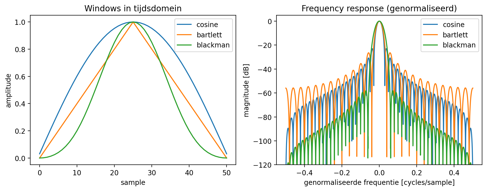

# H11 — Fourier

Korte uitleg:

Dit voorbeeld vergelijkt verschillende vensterfuncties (cosine, Bartlett, Blackman) in het tijdsdomein en toont hun genormaliseerde frequentierespons (magnitude in dB). De afbeelding hierboven is gegenereerd met `Fourier_vb_diff_windows.py` en is opgeslagen in de `figures/` map.
